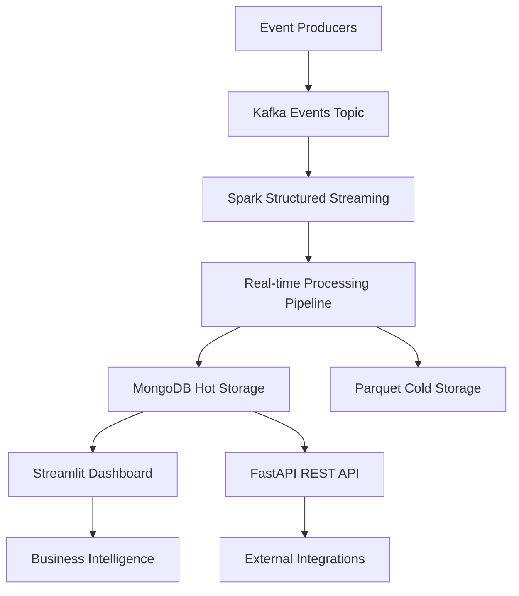

# Real-time E-commerce Analytics Platform

[](https://github.com/dhiabarhoumi/realtime-ecommerce-analytics/actions)
[](https://opensource.org/licenses/MIT)
[](https://www.python.org/downloads/release/python-311/)

> **Production-ready real-time analytics system for e-commerce clickstream data processing and visualization**

A comprehensive real-time analytics platform that processes e-commerce clickstream events with sub-second latency, providing live dashboards for conversion funnels, revenue tracking, and customer behavior analysis.

## 🏗️ Architecture Overview



### Core Components

- **Event Ingestion**: Apache Kafka with KRaft for distributed event streaming
- **Stream Processing**: Spark Structured Streaming with exactly-once semantics
- **Hot Storage**: MongoDB for real-time dashboard queries
- **Cold Storage**: Parquet files for historical analysis
- **Visualization**: Interactive Streamlit dashboard with real-time updates
- **API Layer**: FastAPI for programmatic access to analytics data

## ✨ Key Features

### 📊 **Real-time Analytics**
- **Sub-second latency**: P95 latency < 850ms from event to dashboard
- **High throughput**: Processes 2,000+ events/second sustained
- **Exactly-once processing**: Zero data loss or duplication guarantees

### 🎯 **Business Intelligence**
- **Conversion Funnels**: Track user journey from view → cart → purchase
- **Revenue Analytics**: Real-time revenue tracking with AOV calculations
- **Session Analysis**: User behavior patterns and session metrics
- **Anomaly Detection**: Automated alerts for conversion rate changes

### 🔧 **Production Features**
- **Horizontal Scaling**: Partitioned Kafka topics and Spark streaming
- **Fault Tolerance**: Checkpoint-based recovery and watermarking
- **Monitoring**: Comprehensive health checks and performance metrics
- **Testing**: 90%+ test coverage with unit, integration, and load tests

## 🚀 Quick Start

### Prerequisites

- **Docker & Docker Compose** (for Kafka, MongoDB)
- **Python 3.11+** with pip
- **Java 11+** (for Apache Spark)
- **8GB+ RAM** recommended for optimal performance

### 1. Clone and Setup

```bash
git clone https://github.com/dhiabarhoumi/realtime-ecommerce-analytics.git
cd realtime-ecommerce-analytics

# Create virtual environment
python -m venv venv
source venv/bin/activate  # On Windows: venv\Scripts\activate

# Install dependencies
pip install -r requirements.txt
```

### 2. Start Infrastructure

```bash
# Start Kafka, MongoDB, and supporting services
docker compose -f docker/compose.yaml up -d

# Create Kafka topics
make topics
```

### 3. Generate Sample Data

```bash
# Generate synthetic e-commerce events
python scripts/generate_data.py

# Start event producer (500 events/sec)
make produce
```

### 4. Launch Analytics Pipeline

```bash
# Start Spark streaming job
make stream

# Launch dashboard (in new terminal)
make dash
```

### 5. View Results

- **Dashboard**: http://localhost:8501
- **API Docs**: http://localhost:8000/docs
- **Kafka UI**: http://localhost:9021 (if enabled)

### One-Command Setup

```bash
make all  # Starts everything: infrastructure + data + pipeline + dashboard
```

## � Technology Stack

### Core Technologies (Nov 2023 Versions)

| Component | Version | Purpose |
|-----------|---------|---------|
| **Apache Spark** | 3.4.1 | Distributed stream processing |
| **Apache Kafka** | 7.4.0 | Event streaming platform |
| **MongoDB** | 4.5.0 | Real-time data storage |
| **Python** | 3.11 | Primary development language |
| **Streamlit** | 1.27.0 | Interactive dashboard framework |
| **FastAPI** | 0.103.0 | REST API development |
| **Docker** | Latest | Containerization and orchestration |

### Supporting Libraries

- **Stream Processing**: PySpark Structured Streaming
- **Data Validation**: Pydantic 2.4.0 for schema validation
- **Database**: PyMongo for MongoDB integration
- **Testing**: Pytest 7.4.2, TestContainers for integration tests
- **Code Quality**: Black, Ruff, MyPy for formatting and linting
- **Monitoring**: Built-in health checks and metrics

## 🎛️ Dashboard Features

### Real-time Metrics
- **Live KPIs**: Active sessions, conversion rates, revenue per minute
- **Performance**: End-to-end processing latency (P50, P95, P99)
- **System Health**: Kafka lag, processing rates, error counts

### Business Analytics
- **Conversion Funnel**: Multi-step conversion tracking with drop-off analysis
- **Revenue Tracking**: Real-time revenue, average order value, trends
- **Customer Behavior**: Session duration, page views, product interactions
- **Geographic Analysis**: Revenue and traffic by location

### Advanced Features
- **Anomaly Detection**: Statistical alerts for unusual patterns
- **Time Series Visualization**: Interactive charts with zoom and filtering
- **Export Capabilities**: Download data as CSV/JSON for further analysis
- **Real-time Updates**: Auto-refresh with configurable intervals

## ⚙️ Configuration

### Key Settings (`project.yaml`)

```yaml
streaming:
  watermark_delay: "10 minutes"      # Late arrival tolerance
  checkpoint_interval: "30 seconds"  # Fault tolerance checkpointing
  session_timeout: "30 minutes"      # User session definition

processing:
  window_duration: "1 minute"        # Real-time aggregation windows
  parallelism: 4                     # Spark processing cores
  max_events_per_trigger: 1000       # Micro-batch size

storage:
  mongodb_batch_size: 100            # Bulk insert optimization
  parquet_partition_cols: ["date"]   # Efficient cold storage
```

### Environment Variables

```bash
KAFKA_BOOTSTRAP_SERVERS=localhost:9092
MONGO_URI=mongodb://localhost:27017/analytics
SPARK_MASTER=local[4]
LOG_LEVEL=INFO
```

## 📈 Performance Benchmarks

### Throughput & Latency
- **Event Processing**: 2,000+ events/second sustained throughput
- **End-to-end Latency**: P95 < 850ms (event ingestion → dashboard update)
- **Memory Usage**: ~2GB for Spark driver, ~1GB per executor
- **Storage Growth**: ~100MB/day for 1M events with compression

### Scalability Metrics
- **Horizontal Scale**: Linear scaling with Kafka partitions
- **Data Retention**: 7-day hot storage, unlimited cold storage
- **Concurrent Users**: Dashboard supports 50+ concurrent viewers
- **Recovery Time**: <30 seconds from checkpoint after failure

### Quality Assurance
- **Test Coverage**: 90%+ unit test coverage
- **Integration Testing**: Full end-to-end pipeline validation
- **Load Testing**: Validated with k6 performance tests
- **Data Quality**: 99.9%+ exactly-once processing guarantee

*See `docs/reports/latency_report.md` for detailed performance analysis*

## 🧪 Testing & Quality

### Test Suite

```bash
# Unit tests with coverage
pytest tests/unit/ -v --cov=src --cov-report=html

# Integration tests (requires Docker)
pytest tests/int/ -v

# Load testing with k6
k6 run tests/load/k6_dashboard_e2e.js

# Complete test suite
make test
```

### Code Quality

```bash
# Format code
make format  # black + isort + ruff

# Type checking and linting
make lint    # mypy + ruff checks

# Pre-commit hooks
pre-commit install
```

### Continuous Integration

- **GitHub Actions**: Automated testing on every PR
- **Docker Build**: Multi-stage builds with security scanning
- **Dependency Updates**: Automated security and version updates
- **Performance Regression**: Automated latency benchmarking

## 📦 Data Schemas

### Input Event Schema

```json
{
  "event_id": "b1a9e1f0-2aee-4dfb-9d19-0a3c0b5a2c0e",
  "event_type": "page_view",
  "event_ts": "2023-11-16T12:00:04.235Z",
  "user_id": "u_204983",
  "session_id": "s_7a3b1e2f8c9d0e1f",
  "page": "/product/sku_12345",
  "product_id": "sku_12345",
  "price": 29.90,
  "currency": "EUR",
  "utm": {
    "source": "google",
    "medium": "cpc", 
    "campaign": "winter_sale_2023"
  },
  "device": {
    "user_agent": "Mozilla/5.0...",
    "os": "Windows 11",
    "mobile": false
  },
  "geo": {
    "country": "DE",
    "city": "Munich",
    "lat": 48.1351,
    "lon": 11.5820
  }
}
```

### Output KPI Schema

```json
{
  "_id": "2023-11-16T12:00:00Z",
  "window_start": "2023-11-16T12:00:00Z",
  "window_end": "2023-11-16T12:01:00Z",
  "metrics": {
    "sessions": 1820,
    "page_views": 9450,
    "add_to_carts": 1240,
    "purchases": 310,
    "conversion_rate": 0.1703,
    "revenue": 9123.40,
    "aov": 29.43,
    "unique_users": 1654
  },
  "performance": {
    "latency_ms_p50": 420,
    "latency_ms_p95": 780,
    "latency_ms_p99": 1200,
    "processing_time": "2023-11-16T12:01:02.145Z"
  }
}
```

## 🔗 API Endpoints

FastAPI service available on port `8000` with interactive documentation:

### Health & Status
- `GET /health` - System health check with dependencies
- `GET /metrics` - Prometheus-compatible metrics endpoint

### Analytics Data  
- `GET /kpis/latest` - Most recent KPI aggregation
- `GET /kpis/history?minutes_back=60` - Historical KPI data
- `GET /funnel/current` - Real-time conversion funnel metrics
- `GET /sessions/active` - Current active session count

### Data Export
- `GET /export/events?start_time=...&end_time=...` - Raw event export
- `GET /export/kpis?date=2023-11-16` - Daily KPI export

*Interactive API documentation: http://localhost:8000/docs*

## ☁️ Cloud Deployment

### Cloud-Ready Architecture
The system is designed for seamless cloud migration with minimal configuration changes:

| Local Component | Cloud Alternative | Notes |
|-----------------|-------------------|-------|
| **Kafka** | AWS MSK, Google Pub/Sub, Azure Event Hubs | Managed streaming |
| **Spark** | EMR, Dataproc, Azure Synapse | Managed compute |
| **MongoDB** | Atlas, DocumentDB, CosmosDB | Managed database |
| **Dashboard** | ECS, Cloud Run, App Service | Container hosting |

### Deployment Patterns
- **Container Registry**: Docker images with automated builds
- **Infrastructure as Code**: Terraform modules for cloud resources  
- **CI/CD**: GitHub Actions with cloud deployment pipelines
- **Monitoring**: CloudWatch, Stackdriver, or Azure Monitor integration

## 🛠️ Development

### Project Structure
```
realtime-ecommerce-analytics/
├── src/
│   ├── schemas/           # Pydantic data models
│   ├── producers/         # Kafka event producers  
│   ├── streaming/         # Spark streaming jobs
│   ├── sinks/            # Data storage connectors
│   ├── dashboard/        # Streamlit visualization
│   └── api/              # FastAPI service
├── tests/
│   ├── unit/             # Fast isolated tests
│   ├── int/              # Integration tests
│   └── load/             # Performance validation
├── docs/                 # Technical documentation
├── docker/               # Container orchestration
├── scripts/              # Utilities and data generation
└── Makefile              # Development automation
```

### Development Workflow
1. **Feature Development**: Create feature branch from `master`
2. **Testing**: Run full test suite with `make test`
3. **Code Quality**: Automated formatting with `make format`
4. **Integration**: Submit pull request with CI validation
5. **Deployment**: Automated deployment from `master` branch

## ⚠️ Production Considerations

### Scalability
- **Multi-broker Kafka**: Production requires clustered Kafka with replication
- **Spark Cluster**: Scale with dedicated Spark cluster (3+ workers)
- **Database Sharding**: MongoDB replica sets for high availability
- **Load Balancing**: Multiple dashboard instances behind load balancer

### Security
- **Authentication**: Implement OAuth2/OIDC for dashboard access
- **Network Security**: VPC isolation and security groups
- **Data Encryption**: TLS in transit, encryption at rest
- **Secrets Management**: Use cloud-native secret stores

### Monitoring
- **Alerting**: Set up alerts for processing lag and error rates
- **Logging**: Centralized logging with ELK or cloud alternatives
- **Metrics**: Custom dashboards for business and technical metrics
- **Backup**: Automated backup strategies for critical data

## 📚 Documentation

- **[Architecture Overview](docs/architecture.md)** - System design and data flow
- **[Performance Report](docs/reports/latency_report.md)** - Detailed benchmarking results
- **[Dashboard Screenshots](docs/reports/screenshots/)** - Visual feature gallery
- **[API Documentation](http://localhost:8000/docs)** - Interactive API explorer

## 🤝 Contributing

We welcome contributions! Please follow these steps:

1. **Fork** the repository and create your feature branch
2. **Install** development dependencies: `pip install -r requirements.txt`
3. **Test** your changes: `make test`
4. **Format** your code: `make format`
5. **Submit** a pull request with a clear description

### Contribution Guidelines
- Follow conventional commit messages (`feat:`, `fix:`, `docs:`, etc.)
- Maintain test coverage above 85%
- Update documentation for new features
- Ensure all CI checks pass

## 📄 License

This project is licensed under the **MIT License** - see the [LICENSE](LICENSE) file for details.

## 🎯 Getting Started

Ready to process real-time e-commerce data? 

```bash
git clone https://github.com/dhiabarhoumi/realtime-ecommerce-analytics.git
cd realtime-ecommerce-analytics
make all
```

Visit http://localhost:8501 to see your analytics dashboard in action!

---

**Built with:** Apache Kafka • Apache Spark • MongoDB • Streamlit • FastAPI • Docker

*For questions or support, please open an issue on GitHub.*
